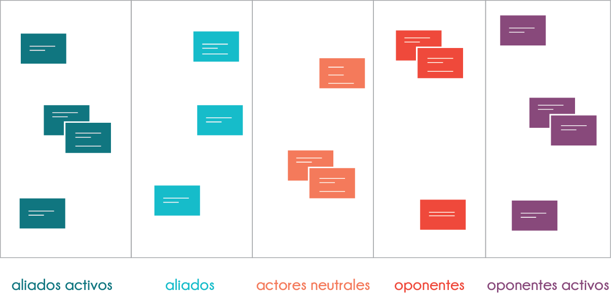

Tiempo estimado: 15 min

Esta actividad está basada en la sección *Expanding our knowledge of actors* de la guía de Seguridad Holística de [Tachtical Technology Collective](https://tacticaltech.org/) disponible en las referencias.

### Justificación
En esta actividad la idea es seguir explorando la organización, recopilando información directamente relacionada con la seguridad de la misma, la cual es necesaria para levantar un modelo de amenazas óptimo en lo sucesivo. Además, resulta un insumo valioso para estudiar la evolución de la organización, su entorno, y los cambios en el modelo de amenazas correspondiente.

### Datos de entrada
* Personas, grupos e instituciones relacionadas a la organización.
* Proyectos y procesos medulares de la organización.
* Información que maneja la organización en sus procesos.
* Posibles consecuencias negativas al vulnerar la información que maneja la organización.

### Productos
* Directos
  * Mapa de actores.
* Indirectos
  * Conciencia grupal sobre los actores relacionados a la organización.

##### Preparación previa
* Haber investigado lo suficiente a la organización como para tener ideas claras de  sus actores asociados. Esto con la idea de iniciar o reanudar la lluvia de ideas en el caso de que el grupo se sienta estancado o lento durante la actividad.

### Materiales
* En caso de realizar la actividad en físico:
  * Notas adhesivas y marcadores o
  * Piezas grandes de papel para pegar en la pared y marcadores.
* En caso de realizar la actividad en digital:
  * Computadora
  * Proyector
  * Hoja de cálculo lista para llenar, mostrando los encabezados con categorías de actores asociados.

### Instrucciones
Una vez relacionados los objetivos de la organización en la actividad anterior, debería ser más claro para los participantes el enfoque que tiene el grupo, y qué tipo de actores están vinculados a su trabajo, además de las motivaciones de dichos actores de cara a la seguridad de la organización.

1. Explicar brevemente que la idea es crear un espectro de aliados ordenados por su actitud ante la organización, buscando emplear pocas opciones para facilitar el proceso. Por ejemplo:
  * Oponentes activos
  * Oponentes
  * Actores neutrales
  * Aliados
  * Aliados activos

    
    (pie de foto)

    Si el grupo y el facilitador lo consideran necesario, podrán dedicar unos minutos a discutir acerca de los criterios por los cuales se desarrollarían las categorías a estudiar.
2. Explicar brevemente que se consideran actores a: personas, grupos e instituciones sin importar su formalidad en tanto cuenten con alguna relación existente o potencial con la organización. Por ejemplo es buen hábito no olvidar actores como:
  * Entes reguladores (impuestos, trabajo, comunicaciones).
  * Empresas de servicios públicos.
  * Proveedores.
  * Personal de mantenimiento y servicios generales.
  * Personas a las que se prestan servicios (víctimas, grupos desprotegidos, ciudadanos buscando asesoría, etc.).
  * Organizaciones similares.
3. Pedir a los participantes que digan y/o escriban los actores, para luego ser colocados en las columnas en donde consideren que van ubicados según su juicio. Si hay alguna discrepancia con el resto del público en la categoría elegida se puede discutir al respecto hasta que haya consenso y el grupo esté conforme con todos los actores en la lista.
4. Una vez que la lista se considere completa preguntar a los participantes por aquellos actores que se encuentran en los extremos (oponentes y aliados activos en el ejemplo anterior). La idea es discutir sobre las **capacidades** y las **motivaciones** de estos actores para perjudicar o ayudar a la organizacion y preparar a los participantes para las actividades de mapeo de datos y modelo de amenazas.
5. Discutir con los participantes sobre algunas consideraciones del mapeo de actores:
  * Los mapas de actores pueden variar en el tiempo de forma muy rápida. Hoy un aliado activo mañana puede ser un oponente activo, o un actor neutral puede tomar partido a raíz de un evento particular.
  * La categorización de los actores es perceptual, quizás para un grupo cierto actor parece un aliado, pero en la práctica puede jugar un papel diferente desconocido para la organización.
  * Generalmente una organización está vinculada a muchos más actores de los que se pueden obtener en una lluvia de ideas de 10 minutos. Vale la pena que el grupo se sienta cómodo con la metodología para que puedan replicarla por su cuenta cuando lo consideren conveniente.
<<<<<<< HEAD
=======

##### Cierre de la actividad
Al finalizar la actividad se puede discutir y hacer énfasis en lo que se logró:
* Se levantó un mapa de actores de la organización y se discutieron sus motivaciones y capacidades.
>>>>>>> d98a881b3980bf3b900b0239ac30a753bada3074

Es importante que el mapa obtenido se encuentre disponible para futuras actividades, si se hace en físico se recomienda no desmontar los papeles y/o notas adhesivas, sino moverlos a un lugar en donde sean visibles y no interfieran con las demás actividades. En caso de hacer la actividad en digital, se recomienda tener a la mano el archivo en donde se recopiló la información.

### Referencias
* [Holistic Security: 2.3 Vision, Strategy and Actors](https://holistic-security.tacticaltech.org/chapters/explore/2-3-vision-strategy-and-actors)
* [Security First: ChampionsCurriculum](https://github.com/securityfirst/championscurriculum/blob/master/communications.md)
<<<<<<< HEAD
=======
* *
>>>>>>> d98a881b3980bf3b900b0239ac30a753bada3074
