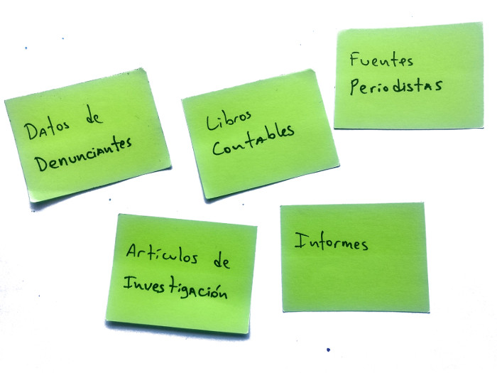
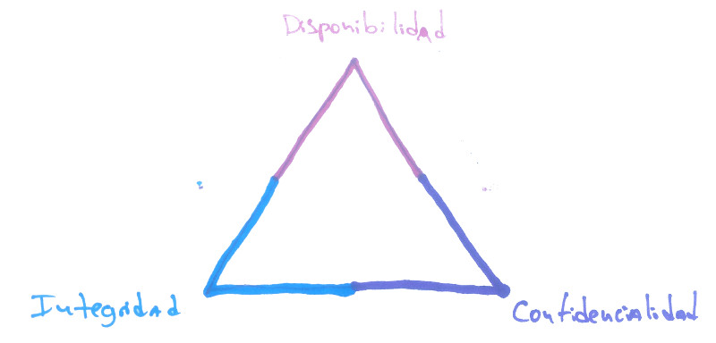
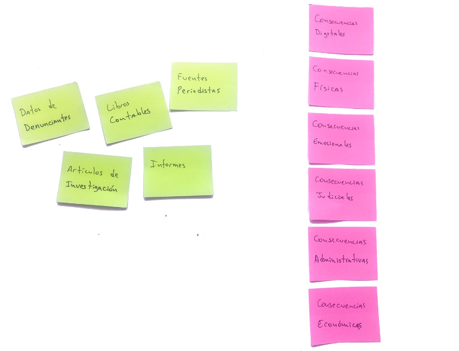

### Justificación
En esta actividad la idea es complementar la recopilación de información sobre la organización y dirigirla hacia la información que maneja y la sensibilidad de la misma. En el proceso se establecerán las bases que permitirán construir las primeras políticas de seguridad de la organización.

### Datos de entrada
* Mapa de actores

### Productos
* Directos
  * Matriz de impactos posibles
  * Mapa de datos con impactos por vulneración asociados
* Indirectos
  * Consciencia grupal sobre la sensibilidad de la información manejada
  * Criterios de clasificación de información dentro de la organización

### Actividades propuestas

#### Mapeo y clasificación de datos
Tiempo estimado: XX min

Esta actividad es una variación propuesta de una dinámica planteada en varios recursos como Holistic Security en su sección "2.4 Understanding and Cataloguing our Information" de de [Tactical Technology Collective](https://tacticaltech.org/) o SaferJourno de [Internews](https://internews.org) entre otros.

La idea de esta activida es mapear todos los objetos de datos que la organización maneja, pensar en las posibles consecuencias que tendría el compromiso de estos objetos, esquematizar estas posibles consecuencias en una matriz de impactos y asociar los objetos de información manejados con los niveles de impacto en la matriz construida.

##### Preparación previa
* En caso de realizar la actividad en digital, tener una hoja de cálculo u otro software con todos los campos y formato necesarios.

##### Materiales
* En caso de realizar la actividad en físico
  * Notas adhesivas y marcadores o
  * Piezas grandes de papel para pegar en la pared y marcadores
* En caso de realizar la actividad en digital
  * Computadora
  * Proyector
  * Hoja de cálculo u otro software con los campos y formato necesarios.

##### Instrucciones
1. Realizar una lluvia de ideas de las piezas de información que maneja la organización, estas pueden ser desde denuncias de víctimas, documentos filtrados, investigaciones en construcción hasta libros contables, publicaciones en redes sociales o informes públicos, ninguna pieza de información legítima es poco relevante para este ejercicio.
  * Es especialmente relevante considerar información en físico.
  * Cada idea se debe colocar en una nota adhesiva o equivalente y estar a la vista de todos.
  * Se puede pasar a la siguiente parte cuando exista consenso entre los participantes, sin embargo, se pueden agregar más items durante el resto de la actividad.

  

2. Con las piezas de información a la vista, explicar brevemente los conceptos de Disponibilidad, Integridad y Confidencialidad. los cuales son utilizados frecuentemente en seguridad de la información para explicar los diferentes tipos de compromiso de la información. Abajo se colocan conceptos breves pero se sugiere revisar otras referencias para tener un entendimiento más amplio de estos conceptos:
  * **Disponibilidad:** Es la capacidad que tiene la información de estar siempre disponible cuando se le requiera. Por ejemplo, cuando un servidor se queda sin electricidad atenta contra la disponibilidad de la información contenida en el.
  * **Integridad:** Es la capacidad que tiene la información de ser confiable en que su contenido no ha sido manipulado o cambiado por un tercero. Por ejemplo, que un tercero malintencionado tome nuestra base de datos de víctimas y cambie algunos datos se considera una amenaza a la integridad de esa base de datos.
  * **Confidencialidad:** Es la capacidad que tiene la información de ser accesible sólo a aquellos que deben tener acceso por definición. Por ejemplo, cuando un tercero puede leer correos electrónicos que se envían dos personas se considera una amenaza a la confidencialidad de la información transmitida por el correo.

  

3. Conversar con los participantes sobre los tipos de consecuencias negativas que puede afrontar la organización ante algún compromiso de la información que se maneja y crear aparte de la lluvia de ideas de piezas de información una lista vertical con los **tipos de consecuencias** como se muestra en la figura

  
  La idea es generar una matriz cuyo eje vertical corresponde a esta clasificación de consecuencias, una propuesta completa (puede ser simplificada dependiendo del facilitador y del grupo) puede ser la que se encuentra a continuación:
  * **Consecuencias digitales:** Consecuencias que afecten la presencia online de la organización. Por ejemplo relacionadas a los medios sociales, servidores, cuentas de correo, servicios usados por el equipo interno, etc.
  * **Consecuencias físicas:** Consecuencias relacionadas a la integridad de personas, objetos y espacios. Por ejemplo agresiones físicas, muerte, destrucción de espacios, pérdida de recursos, etc.
  * **Consecuencias emocionales:** Consecuencias relacionadas al bienestar psicosocial de las personas involucradas a la organización, esto no solo incluye al equipo sino tambien a proveedores, beneficiarios, víctimas, etc. Normalmente están relacionados a situaciones que crean miedos, estrés, fatiga y traumas a los actores relacionados.
  * **Consecuencias judiciales:** Consecuencias que afectan la integridad judicial de personas asociadas a la organización. Por lo general están relacionadas a arrestos, retenciones, allanamientos, juicios, etc.
  * **Consecuencias administrativas:** Consecuencias relacionadas al estado legal de organizaciones y personas más allá de lo judicial. Frecuentemente relacionadas al cumplimiento de regulaciones, impuestos, inspecciones, pérdida de la figura legal de la organización, infracciones a leyes, etc.
  * **Consecuencias económicas:** Consecuencias relacionadas directamente a la pérdida de dinero y bienes por parte de la organización y/o sus integrantes.

4. Viendo CIA pensar en consecuencias por eje usando piezas y CIA (postmortem)
5. Determinar categorías de consecuencias por severidad (proponer redacción) y hacer matriz
6. Rellenar espacios vacios
7. comentar que con esto se tiene en esencia la base para la primera política (Clasificación de información)
8. Mapeo de dispositivos y canales de comunicación usados
9. Mapeo de personas que manejan las piezas
10. Cruce de información completa para generar directivas

### Referencias
* [Holistic Security: 2.4 Understanding and Cataloguing our Information](https://holistic-security.tacticaltech.org/chapters/explore/2-4-understanding-and-cataloguing-our-information)
* [SaferJourno](https://www.internews.org/resource/saferjourno-digital-security-resources-media-trainers)
* [Security First: ChampionsCurriculum](https://github.com/securityfirst/championscurriculum/blob/master/communications.md)
* [Wikipedia: Seguridad de la información](https://es.wikipedia.org/wiki/Seguridad_de_la_informaci%C3%B3n)
*
