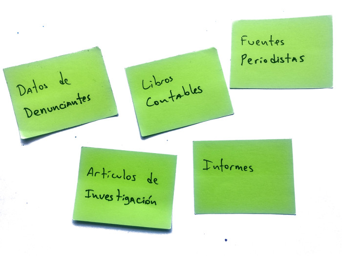
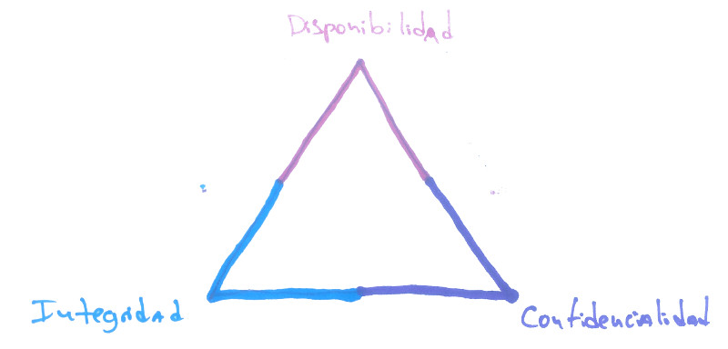
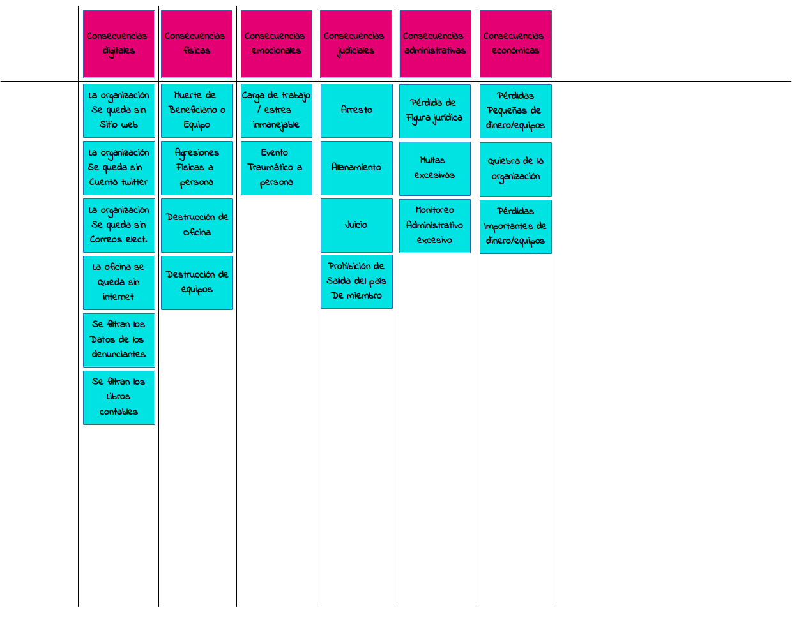
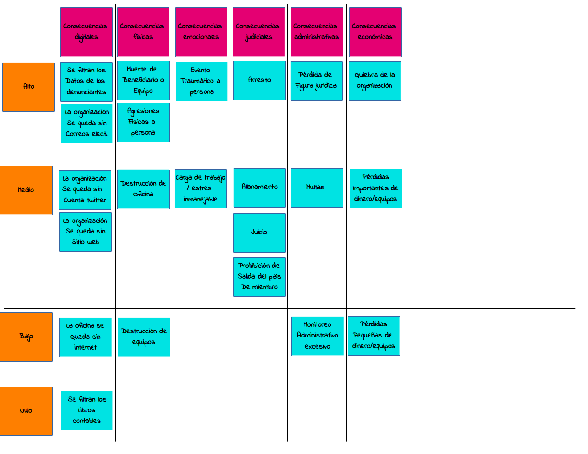
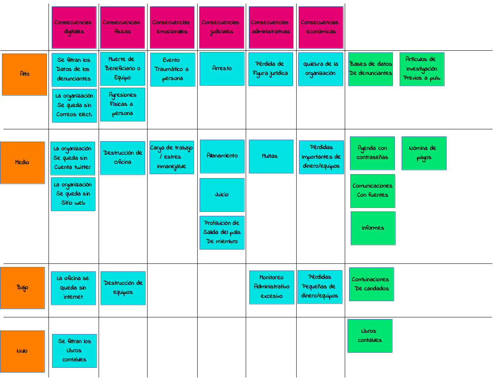

Tiempo estimado: 120 min

Esta actividad es una variación propuesta de una dinámica planteada en varios recursos como Holistic Security en su sección "2.4 Understanding and Cataloguing our Information" de [Tactical Technology Collective](https://tacticaltech.org/) o SaferJourno de [Internews](https://internews.org) entre otros.

La idea de esta actividad es mapear todos los objetos de datos que maneja la organización, pensar en las posibles consecuencias que tendría el compromiso de estos objetos, esquematizar estas posibles consecuencias en una matriz de impactos, y asociar los objetos de información manejados con los niveles de impacto en la matriz construida.

### Justificación
La idea de esta actividad es mapear todos los objetos de datos que maneja la organización, pensar en las posibles consecuencias que tendría el compromiso de estos objetos, esquematizar las posibles consecuencias en una matriz de impactos, y asociar los objetos de información manejados con los niveles de impacto en la matriz construida.

La idea de esta actividad es completar la recopilación de información sobre la organización, y así redirigir la misma hacia la sensibilidad de la información. En el proceso se establecerán las bases que permitirán construir las primeras políticas de seguridad para la organización.

### Datos de entrada
* Mapa de actores

### Productos
* Directos
  * Matriz de consecuencias posibles.
  * Mapa de datos con impacto por vulneraciones asociadas.
* Indirectos
  * Conciencia grupal sobre la sensibilidad de la información manejada.
  * Criterios de clasificación de información dentro de la organización.

<<<<<<< HEAD
#### Preparación previa
=======
##### Preparación previa
>>>>>>> d98a881b3980bf3b900b0239ac30a753bada3074
* En caso de realizar la actividad en digital, se sugiere disponer de una hoja de cálculo u otro software con todos los campos y formatos necesarios.

#### Materiales
* En caso de realizar la actividad en físico:
  * Notas adhesivas y marcadores o
  * Piezas grandes de papel para pegar en la pared y marcadores
* En caso de realizar la actividad en digital:
  * Computadora
  * Proyector
  * Hoja de cálculo u otro software con los campos y formatos necesarios.

#### Instrucciones
1. Realizar una lluvia de ideas con las piezas de información que maneja la organización, estas pueden incluir desde denuncias de víctimas, documentos filtrados, investigaciones en construcción hasta libros contables, publicaciones en redes sociales y/o informes públicos. Ninguna pieza de información legítima es poco relevante para este ejercicio.
  * Es especialmente relevante considerar información en físico.
  * Cada idea se debe colocar en una nota adhesiva o equivalente y estar a la vista de todos.
  * Se puede avanzar cuando exista consenso entre los participantes.
  * Se pueden agregar más items durante el resto de la actividad.

  

2. Con las piezas de información a la vista, explicar brevemente los conceptos de Disponibilidad, Integridad y Confidencialidad, los cuales son utilizados frecuentemente en seguridad de la información para explicar los diferentes tipos de compromiso de la información. Se sugiere desarrollar conceptos breves y revisar otras referencias para tener un entendimiento más amplio:
  * **Disponibilidad:** Es la capacidad de estar siempre al alcance de quien la necesite. Por ejemplo, cuando un servidor se queda sin electricidad atenta contra la disponibilidad de la información contenida en el mismo.
  * **Integridad:** Es la capacidad de ser confiable, en  el mero sentido de que su contenido no ha sido manipulado o alterado por un tercero. Por ejemplo, que un tercero malintencionado tome una base de datos de víctimas y modifique la información se considera una amenaza a la integridad de esa base de datos.
  * **Confidencialidad:** Es la capacidad de ser accesible sólo a quienes corresponde por definición. Por ejemplo, cuando un tercero puede leer correos electrónicos que se envían dos personas se considera una amenaza a la confidencialidad de la información transmitida por el correo.

  

3. Conversar con los participantes sobre los tipos de consecuencias negativas que puede afrontar la organización ante algún compromiso de la información que se maneja. Crear aparte de la lluvia de ideas de piezas de información una lista horizontal con los **tipos de consecuencias** como se muestra en la figura.

  
  La idea es generar una matriz cuyo eje horizontal corresponda a esta clasificación de consecuencias, una propuesta completa (o simplificada dependiendo del facilitador y del grupo) puede ser la que se encuentra a continuación:
  * **Consecuencias digitales:** Que afecten la presencia online o recursos digitales de la organización. Por ejemplo, relacionadas a los medios sociales, servidores, cuentas de correo, servicios usados por el equipo interno, etc.
  * **Consecuencias físicas:**  Son las relacionadas a la integridad de personas, objetos y espacios. Por ejemplo, agresiones físicas, muerte, destrucción de espacios, pérdida de recursos, etc.
  * **Consecuencias emocionales:** Son las relacionadas al bienestar psicosocial de las personas involucradas con la organización, esto no solo incluye al equipo sino tambien a proveedores, beneficiarios, víctimas, etc. Normalmente están relacionados a situaciones que crean miedos, estrés, fatiga y traumas a los actores relacionados.
  * **Consecuencias judiciales:** Son aquellas que afectan la integridad judicial de personas asociadas a la organización. Por lo general, están relacionadas a arrestos, retenciones, allanamientos, juicios, etc.
  * **Consecuencias administrativas:** Son aquellas relacionadas al estado legal de organizaciones y personas más allá de lo judicial. Frecuentemente relacionadas al cumplimiento de regulaciones, impuestos, inspecciones, pérdida de la figura legal de la organización, infracciones a leyes, etc.
  * **Consecuencias económicas:** Son aquellas relacionadas directamente a la pérdida de dinero y bienes por parte de la organización y/o sus integrantes.

  Estos tipos de consecuencias son propuestos, en el caso de querer simplificar el ejercicio se pueden combinar o excluir explícitamente algunos de los ejes propuestos, incluso si el equipo lo considera pertinente se pueden agregar nuevos tipos. Por ejemplo, consecuencias de imagen o religiosas (si aplican).

4. Teniendo claro los tipos de consecuencias, se sugiere pedir a los participantes que piensen en posibles consecuencias producto del compromiso de las piezas de información mapeadas en términos de disponibilidad, integridad y confidencialidad, tomar notas de estos y colocarlos en notas adhesivas o su equivalente digital debajo del tipo de consecuencia al que pertenece (digital, físico, legal, etc.)
  * Es normal y esperado que muchas consecuencias se repitan, en estos casos con la nota adhesiva o equivalente ya existente será suficiente.
  * Pensar en disponibilidad, integridad y confidencialidad es una ayuda para facilitar la discusión y la lluvia de ideas de consecuencias, sin embargo, si el equipo se siente cómodo planteando las consecuencias posibles en otros términos puede funcionar sin problemas siempre y cuando representen consecuencias posibles y puedan ser priorizadas en el siguiente paso.
  * Es normal que el compromiso de una pieza de información pueda tener consecuencias en más de un eje.

  Algunos ejemplos de consecuencias pueden ser:
  * Pérdida de la figura jurídica de la organización (Consecuencia administrativa).
  * Muerte de denunciantes (Consecuencia física).
  * Agresiones a beneficiarios (Consecuencia física).
  * Multa excesiva (consecuencia económica).
  * Renuncia o despido de personal (Consecuencia administrativa).
  * Pérdida del sitio web (Consecuencia digital).
  * Allanamiento de la sede (Conseciencia judicial).
  * Aumento drástico de niveles de estrés en el equipo de trabajo (consecuencia emocional).
  * Aumento excesivo de la carga de trabajo del equipo (consecuencia emocional).

  

5. Luego de obtener algunas consecuencias de cada uno de los tipos definidos se introduce la idea de calificar las consecuencias mapeadas según su nivel de impacto, se propone crear un eje vertical que represente impactos nulos, bajos, medios y altos. En el caso de que el facilitador y el equipo se sientan cómodos al respecto, se puede cambiar esta escala a cualquier otra que se considere conveniente (del 1 al 10, agregar a la propuesta impacto crítico, etc.). Luego de creado este eje se procede a ubicar con el apoyo del equipo las amenazas mapeadas en las distintas categorías como se muestra en la figura.

  

  Algunas consideraciones son:
  * Es posible que algunos espacios queden en blanco, dependiendo del caso vale la pena preguntarle al equipo qué consecuencias estan faltando en esos espacios. En el caso de impactos bajos o nulos no es obligatorio colocar consecuencias directas, esto se puede explicar con que todo lo que se considere por debajo de la consecuencia con menor impacto es irrelevante en términos de riesgos.
  * A esta parte de la actividad se le debe dedicar un tiempo adecuado ya que representa el pilar de la primera política de seguridad de la organización (clasificación de información).

6. Una vez que el equipo esté conforme con la matriz de consecuencias, se pueden asociar las piezas de información mapeadas al comienzo de la actividad con el nivel de impacto de las consecuencias correspondientes al compromiso. Esto puede hacerse de múltiples formas, una propuesta se dispone en el siguiente grafico.

  

#### Cierre de la actividad
Al finalizar la actividad se puede discutir y hacer énfasis en lo que se logró:
* Se definieron ejes de consecuencias y se asociaron a la información que la organización maneja.
* Se establecieron las bases de la política de clasificación de información, así cada vez que se maneje un nuevo objeto o pieza de información se puede determinar el nivel de impacto asociado al compromiso de este, y con los productos que se generarán más adelante se puede determinar con facilidad qué medidas de seguridad se deben tomar al manipular estos nuevos objetos de datos.

### Referencias
* [Holistic Security: 2.4 Understanding and Cataloguing our Information](https://holistic-security.tacticaltech.org/chapters/explore/2-4-understanding-and-cataloguing-our-information)
* [SaferJourno](https://www.internews.org/resource/saferjourno-digital-security-resources-media-trainers)
* [Security First: ChampionsCurriculum](https://github.com/securityfirst/championscurriculum/blob/master/communications.md)
* [Wikipedia: Seguridad de la información](https://es.wikipedia.org/wiki/Seguridad_de_la_informaci%C3%B3n)
<<<<<<< HEAD

=======
* [Hand-book Of the Modern Development Specialist | Responsible Data Forum](https://responsibledata.io/resources/handbook/)
>>>>>>> d98a881b3980bf3b900b0239ac30a753bada3074
>>>>>>>