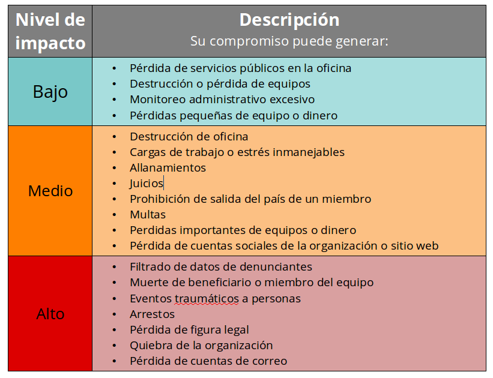
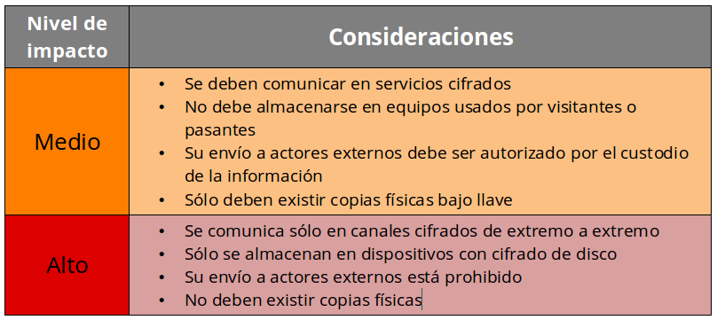

# Política de protección de información
Tiempo estimado: 15 min

### Justificación
Uno de los aspectos medulares de cualquier organización es la manipulación de información, ya que cualquier proceso que se realice puede ser abstraido a la generación, procesamiento, almacenamiento y publicación de información, y en el caso de organizaciones que realizan activismo o documentación en el área de Derechos Humanos existe una variedad importante de tipos de información cuyo compromiso puede desencadenar consecuencias negativas para la organización, sus miembros o actores relacionados. La idea de desarrollar una política de protección de información es establecer una serie de lineamientos que ayuden a tratar cada pieza de información de la forma más adecuada posible y acorde a la sensibilidad de la misma.

### Datos de entrada
* Mapa de datos desarollado en la sección *Mapeo y clasificación de información*
* Mapa de flujos de datos desarollado en la sección *Mapeo de flujos de información*
* [Plantilla 1: Política de protección de información](https://sdamanual.org/es/plantillas/p1) abierta en un equipo para irla alimentando en el transcurso de la actividad

### Conceptos Asociados
Niveles de sensibilidad de información
Principio de "necesidad de saber" (Need to know)
Responsables de la información
  Custodio de la información (ver cuales mas faltan)
Disposición de información

### Políticas a desarrollar
La **Política de uso aceptable, cuentas y contraseñas** a desarrollarse en esta actividad, abstrae contenidos existentes en las siguientes políticas descritas en marcos de referencia estandarizados:
* **Política de uso aceptable de equipos:** Esta d
* **Política de uso aceptable de internet:** Esta de
* **Política de uso aceptable del correo electrónico:** Esta de
* **Política de uso aceptable de redes sociales:** Esta de
* **Politica de contraseñas:** Esta def

#### Preguntas guía
1. ¿Cuál es el alcance de la política propuesta?
2.

##### 1. Alcance de la política
En esencia, el alcance asociado a esta política abarca dos aspectos:

##### 2. Niveles de sensibilidad de la información manejada
> ¿Qué niveles de sensibilidad tiene la información manejada por la organización y cómo se describen?
> ¿Cómo se puede clasificar cualquier pieza de información en los niveles de sensibilidad propuestos?

##### 3. Responsables de la información
> ¿Quiénes son los responsables del resguardo de la información?

Cuando

##### 4. Restricción base de acceso a la información
> ¿Quiénes deben tener acceso a la información y quienes no?

  

##### 5. Directivas generales de manipulación de información
> ¿Qué medidas se deben tomar para manipular información según su nivel de sensibilidad?

  

##### 6. Directivas específicas de manipulación de información
> ¿Qué herramientas, prácticas y dispositivos específicos se deben emplear para manipular la información según su nivel de sensibilidad?

### Aspectos excluidos en la política

### Referencias
* [Information Classification Policy | ISO](http://www.iso27001security.com/ISO27k_Model_policy_on_information_classification.pdf)
