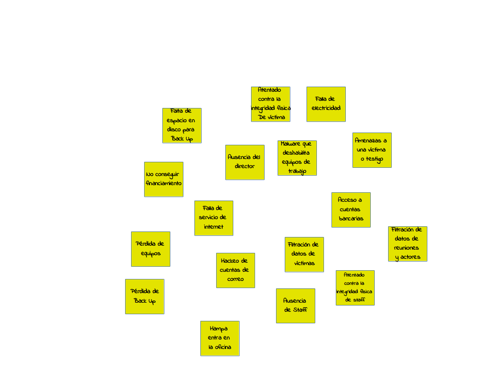
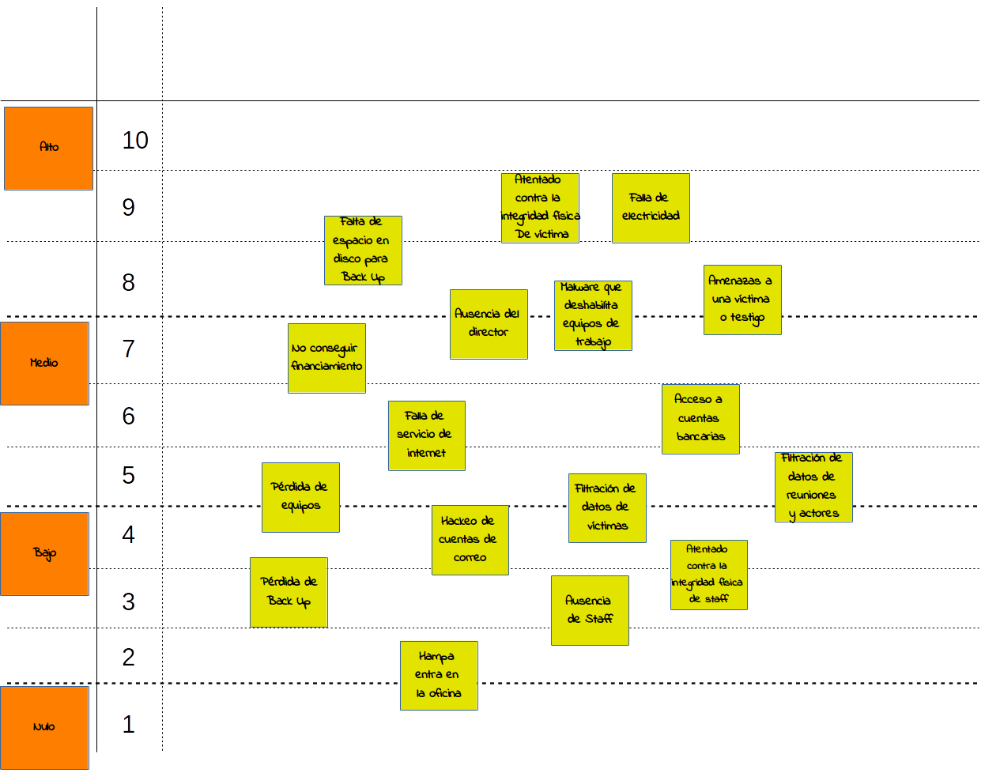
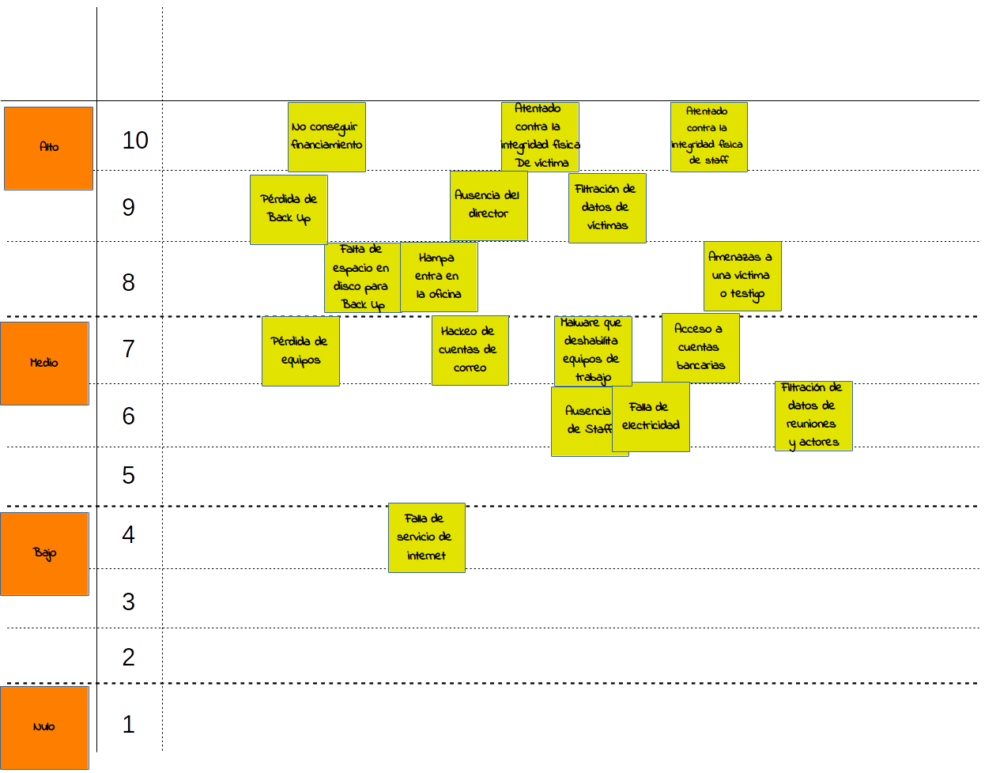
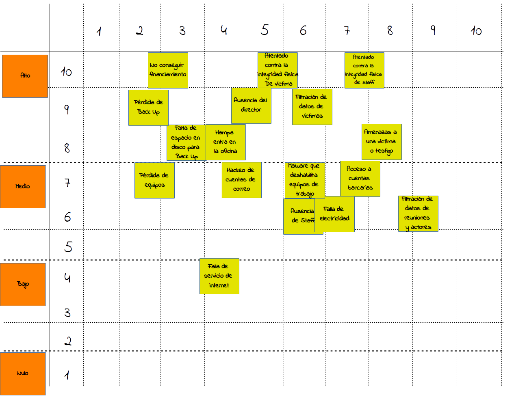
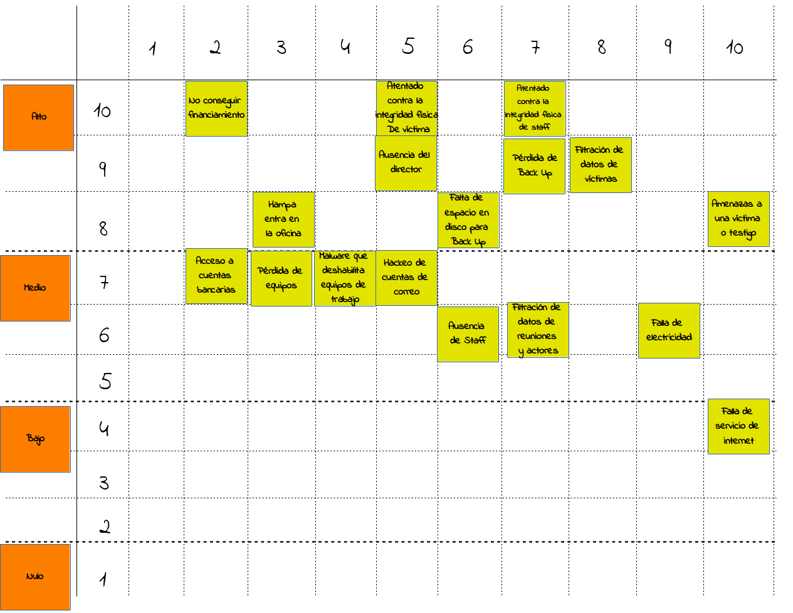
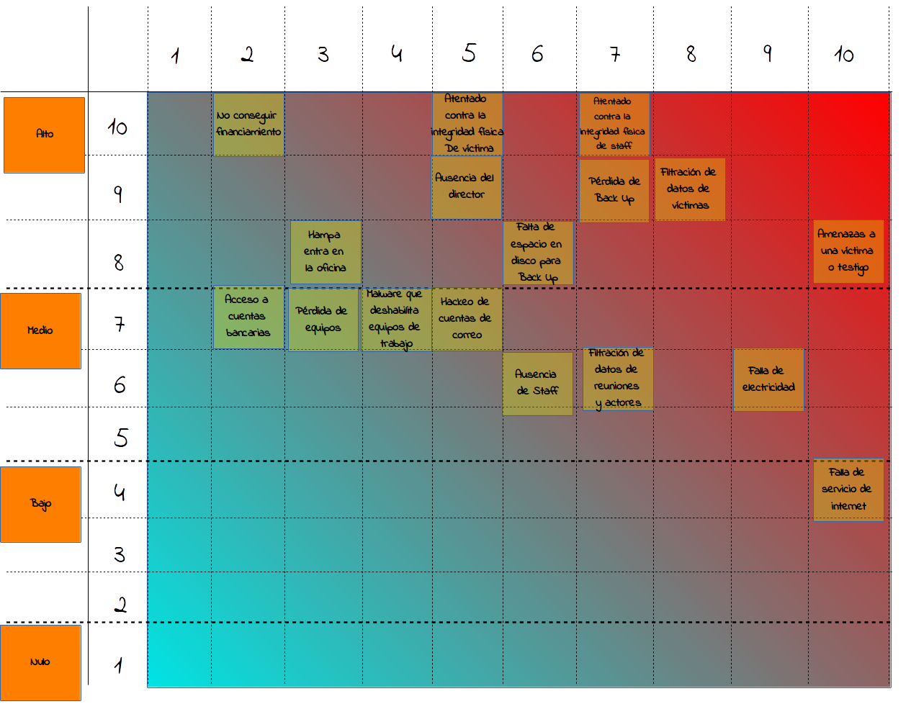

Tiempo estimado: 120 min

### Justificación
La idea de esta actividad es introducir el concepto de análisis de riesgo a la organización y utilizar una abstracción de la metodología de matrices de riesgo para hacer un primer analisis del contexto de seguridad de la organización, el cual será utilizado para seleccionar escenarios de seguridad y asi elaborar procedimientos pertinentes al caso en la segunda actividad.

### Datos de entrada
* Niveles de consecuencias desarrollados en la actividad de Mapeo y clasificación de información en la sección 01.

### Productos
* Directos
  * Listado de amenazas posibles a la organización priorizado por impacto posible y probabilidad de ocurrencia estimada por el equipo.
* Indirectos
  * Mejor entendimiento de los posibles escenarios adversos por los que puede atravesar la organización.
  * Mejores criterios de categorización colectiva de amenazas posibles.
  * Mejores criterios de priorización de amenazas potenciales para su atención y establecimiento de controles de seguridad.

### Preparación previa
* En caso de realizar la actividad en digital, se sugiere disponer de una hoja de cálculo u otro software con todos los campos y formatos necesarios.

### Materiales
* En caso de realizar la actividad en físico:
  * Notas adhesivas y marcadores o
  * Piezas grandes de papel para pegar en la pared y marcadores
* En caso de realizar la actividad en digital:
  * Computadora
  * Proyector
  * Hoja de cálculo u otro software con los campos y formatos necesarios.

### Instrucciones
1. Introducir al grupo el concepto de amenaza (**Posible evento negativo** ocurrido a un recurso determinado), considerando los siguientes aspectos:
  * Estas pueden tener causas humanas y no humanas (desastres naturales, reacciones espontáneas, desgaste y malfunciones no programadas, etc.).
  * Estas pueden ser intencionales o accidentales.
  * Estas pueden ser provocadas o fortuitas.
  * Estas pueden afectar a recursos físicos, digitales, humanos, legales y administrativos entre otros. De hecho muchas organizaciones consideran la afectación de su imagen y posicionamiento como un recurso, siendo una consideración válida dentro del ejercicio.

  Por lo general, es más fácil para los participantes usar una estructura en la redacción de amenazas similares a estas:
  > [Algo malo pasa]

  **A.** Ausencia del director.
  
  **B.** Ladrones entran a la oficina.

  > Que [algo malo le pase a algún recurso o actor vinculado a la organización]

 **A.** Que hackeen la cuenta de Twitter.
 
 **B.** Que se pierda el acceso a las cuentas bancarias.

  Sin embargo, en algunas ocasiones esta forma de construir las amenazas puede resultar tan vaga que no representa posibles eventos sino otras cosas, como por ejemplo vulnerabilidades o ausencia de medidas de seguridad. En ese sentido se recomienda a los facilitadores *asegurarse de que la redacción de las amenazas a lo largo del ejercicio corresponda a eventos*. Si el facilitador lo considera conveniente, puede plantear una estructura de redacción que ayude a disminuir errores, por ejemplo:
  > Que [un actor] [ejecute una acción] a/sobre [un recurso] [provocando ciertas consecuencias – opcional]

 **A.** Que un hacker introduzca un malware en la computadora del director de la organización.
 
 **B.**  Que el organismo de Inteligencia de mi país monitoree las llamadas telefónicas con las fuentes periodísticas exponiendo la integridad física de estas.

  > Que [un evento] [ejerza una acción] a/sobre [un recurso][provocando ciertas consecuencias – opcional]

  **A.** Que ocurra un terremoto de 7.5 o más, destruyendo el datacenter de la empresa donde se aloja la página web.
  
 **B.** Que un apagón deje sin electricidad a la oficina imposibilitando el trabajo en las computadoras.

  Esta redacción puede adaptarse para considerar amenazas sin adversarios o eventos claros, así como cualquier otra variación de las amenazas que no cubren directamente estas propuestas de redacción.

2. Pedir a los participantes que piensen en amenazas para la organización, tomar nota de estas y colocarlas de forma visible para todos.
  
3. Con todas las amenazas en un mismo sitio, utilizar los niveles de impacto desarrollados en la actividad de *Mapeo y clasificación de información* y colocarlos como el eje vertical de una matriz, luego con la ayuda de los participantes asignar a cada amenaza un nivel de impacto ubicando la nota adhesiva o equivalente a la altura del nivel de impacto seleccionado.
  * Se sugiere además de colocar los niveles de impacto cualitativos definidos anteriormente, disponer de una escala numérica como se muestra en el gráfico. Esto puede ayudar a cuantificar el nivel de riesgo luego de completar la actividad.
  
  Agregando los niveles de impacto.

  
  Reorganizando las amenazas.

4. Plantear el concepto de probabilidad de ocurrencia y definir una escala para representarla en la matriz de riesgo elaborada. Reorganizar en el eje horizontal con la ayuda del grupo las amenazas de tal modo que coincidan no solo con la escala de impacto sino tambien con la probabilidad de ocurrencia seleccionada en cada caso, completando la matriz de riesgo de la organización, como se muestra en el gráfico.
  * En los gráficos se sugiere una escala del 1 al 10, esta puede ser cambiada por otro tipo de escalas como por ejemplo las descritas abajo. Sin embargo, si se quiere hacer un análisis numérico de las amenazas es necesario que la escala también sea numérica e igual a la escala utilizada para los niveles de riesgo,
    * Probabilidad baja, media y alta.
    * Probabilidad nula, baja, alta y certeza de ocurrencia.
    * Escala del 1 al 5.
    
    Agregando los niveles de probabilidad de ocurrencia.

    
    Reorganizando las amenazas.

5. Discutir sobre niveles de riesgo presentes en la matriz y realizar una lectura del contexto de seguridad de la organización a través de esta herramienta.
  * Es esencial que los participantes tengan claro que las amenazas más importantes para atender deben ser aquellas que tienen altos niveles de impacto y altas probabilidades de ocurrencia asociados (en este caso aquellas más cercanas a la esquina superior derecha de la matriz).
  * En el caso de querer hacer un análisis cuantitaivo de los niveles de riesgo habiendo usado escalas numéricas en los niveles de impacto y probabilidad de ocurrencia, bastará con multiplicar estos valores para cada amenaza y ordenar de mayor a menor los resultados obtenidos (niveles de riesgo).
  * Este ejercicio tiene como resultado un análisis **subjetivo** por parte de los miembros de la organización, por ningún motivo representa un análisis riguroso y preciso del contexto de riesgo de la organización. Incluso si el mismo equipo repitiera la actividad al día siguiente pudiera resultar una matriz de riesgo diferente.
  * Esta matriz de riesgo, asi como cualquier otro insumo que represente el contexto de riesgo de la organización, es un insumo **temporal** que no considera que los riesgos cambian a través del tiempo. Es muy importante hacer énfasis con los participantes que esta matriz representa "una foto" del estado de riesgo para ese momento en particular, y que la invitación es a repetir este ejercicio periódicamente para actualizar esta representación obtenida.

  
  Agregando los niveles de impacto.

### Cierre de la actividad
Al finalizar la actividad se puede discutir y hacer énfasis en lo que se logró:
* Se definieron criterios para la detección de amenazas, y se hizo un mapeo contenido de las amenazas actuales propuestas por el equipo.
* Se desarrollaron criterios de estudio y priorización de las amenazas. También se emplearon estos criterios durante el ejercicio de amenazas mapeadas.
* Se introdujo una metodología de construcción de matrices de riesgo que puede ser replicada en el futuro por la organización.

### Referencias
* SAFETAG
* SaferJourno
* 