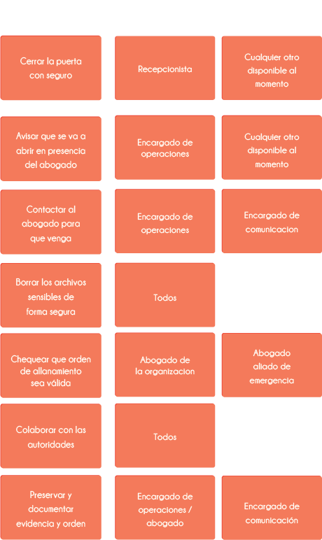
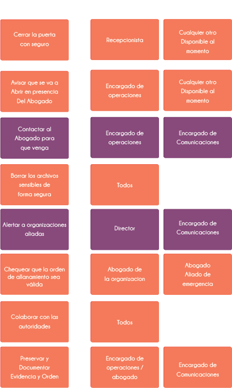
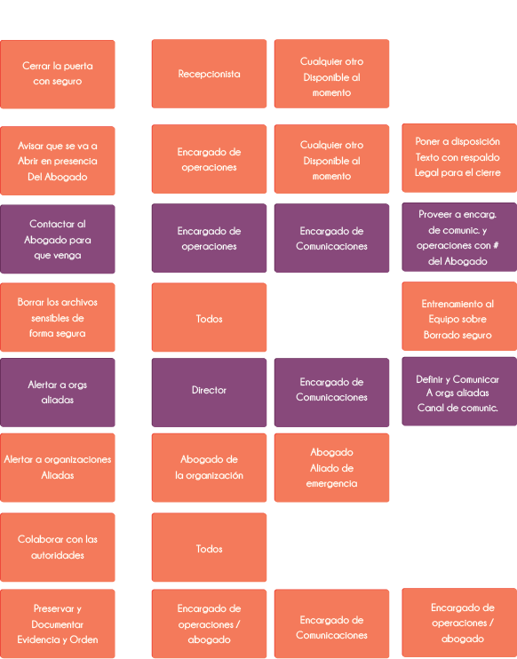
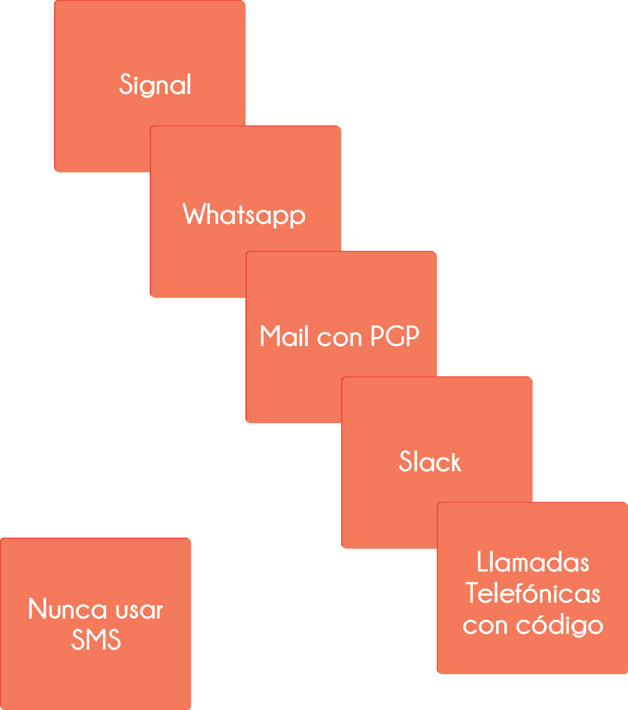

Tiempo estimado: 45 min

### Justificación
La idea de esta actividad es complementar las políticas desarrolladas anteriormente como **estrategias preventivas** con el desarrollo de procedimientos a ser aplicados durante incidentes de seguridad como **estrategias reactivas** que buscan mitigar el impacto de las amenazas una vez concretadas. Específicamente esta actividad busca abstraer los conceptos de elaboración de procedimientos, planes de comunicaciones, planes de sucesión y actividades de preparación en una sola dinámica que sirva de introducción al área de *respuesta a incidentes* desarrollada en la literatura de seguridad de la información.

### Datos de entrada
* Matriz de riesgo

### Productos
* Directos
  * Procedimiento de seguridad inicial para uno o dos escenarios puntuales seleccionados.
* Indirectos
  * Herramientas para desarrollar cualquier otro procedimiento de seguridad faltante por parte de la organización.
  * Mejor entendimiento de la importancia de las comunicaciones internas, externas y de la sucesión de responsabilidades durante la atención de incidentes de seguridad.

### Preparación previa
* En caso de realizar la actividad en digital, se sugiere disponer de una hoja de cálculo u otro software con todos los campos y formatos necesarios.

### Materiales
* Pliegos de papel grandes para pegar en la pared.
* Notas adhesivas (preferiblemente de varios colores).
* Marcadores para escribir en las notas adhesivas.

### Instrucciones
1. Revisar la matriz de riesgo levantada en la actividad anterior y seleccionar una o dos amenazas que se consideren pertinentes para levantar procedimientos de seguridad. Algunas consideraciones pueden ser:
  * Es normal que hayan amenazas que dependan altamente de personal o aliados externos para su resolución, aunque es deseable que sean amenazas resolubles en mayor medida por los mismos integrantes de la organziación, el primer tipo de amenaza es válido para desarrollar la actividad.
2. Para cada amenaza, que desde ahora serán tratadas como incidentes de seguridad ya que se estará preparando el procedimiento para su ocurrencia, hacer una lluvia de idea de acciones que se deberían tomar como pasos, anotar cada uno en notas adhesivas y pegar en el papel o pared, luego reordenar a medida que se agregan nuevos pasos. Como ayuda para el grupo, usualmente las acciones que se toman en un procedimiento buscan:
  * Minimizar el daño.
  * Limpiar artefactos restantes del incidente.
  * Reanudar actividades tan pronto como se pueda.

  

3. Para cada paso preguntar quién lo ejecutaría. Anotar en una nota adhesiva y colocar en una segunda columna en la pared junto al paso en cuestión, se puede preguntar al grupo quien supliría a este responsable en el caso de que no se encuentre durante el incidente. En los casos en que aplique tomar nota y colocar estos suplentes debajo del responsable principal como muestra el grafico.
  

4. Con consenso en el grupo sobre los pasos del procedimiento, preguntar en qué puntos se deben establecer comunicaciones con actores externos a la organización. La idea es anotar estos puntos de comunicación como nuevos pasos (idealmente en un color diferente) e integrarlos a los pasos del procedimiento reordenando los pasos existentes.
  * Estas comunicaciones normalmente son obligatorias o altamente deseables para resolver el incidente, como redes de aliados, proveedores externos, etc.
  * Es posible que en la misma dinámica de la actividad se haya adelantado este mapeo de comunicaciones en el paso 2 de forma natural, en ese caso con completar cualquier comunicación faltante y continuar será suficiente.
  * Para cada paso relacionado a comunicaciones externas, verificar que siempre aparezca a quién se contacta, ya sea en el paso o en el responsable.

  

5. Crear una tercera columna con el encabezado "Preparación" y para cada paso preguntarle al equipo *¿Qué hace falta garantizar ANTES de que ocurra el incidente para que se pueda cumplir este paso?*. Tomar nota de cada paso de preparación en una nota adhesiva y colocarla junto al paso correspondiente, es normal que algunos pasos no tengan acciones de preparación asociadas. Algunos ejemplos usuales de pasos de preparación son:
  * que A tenga el contacto de B consultor externo.
  * que C sepa como apagar el servidor interno.
  * que todos sepan borrar información de forma segura.

  

6. Discutir con el grupo *¿Cómo se comunicarían entre ellos durante la resolución del incidente?* y guiar la discusión sobre qué canales se consideran seguros y confiables para mantener al grupo comunicado durante el incidente, así como cuáles se utilizarían de manera formal durante *éste* tipo de incidente. Se sugiere tomar nota de estos canales y listarlos en orden de prioridad en caso de que el primero falle durante el incidente.
  * Vale la pena recordar que diferentes incidentes pueden afectar diferentes vías de comunicación.
  

7. Sugerir al equipo vaciar la información que se recopiló durante la actividad en un documento formal. Se puede utilizar la plantilla 4 disponible en el sitio web de este material (https://sdamanual.org/es).

### Cierre de la actividad
Al finalizar la actividad se puede discutir y hacer énfasis en lo que se logró:
* Se elaboraron procedimientos reales para incidentes específicos.
* Se asociaron los pasos del procedimiento con encargados y sucesores en caso de no estar disponibles.
* Se integró un plan de comunicaciones externas al procedimiento.
* Se establecieron las bases de comunicaciones internas durante incidentes.
* Se exploraron los pasos para construir procedimientos de seguridad con la metodología utilizada.

Luego de finalizada la actividad, vale la pena proponer al grupo después de sucedido cualquier incidente, realizar una reunión posterior en donde el equipo se haga al menos las siguientes preguntas:
  * ¿Qué pasó y en qué momentos?
  * ¿Qué tan bien respondió el equipo al incidente?
  * ¿Se siguieron los procedimientos? ¿Éstos fueron adecuados?
  * ¿Hubo pasos o acciones tomadas que inhibieran la recuperación del incidente?
  * ¿Qué haría el equipo diferente si pasa algo similar en el futuro?
  * ¿Qué acciones correctivas pueden prevenir incidentes similares en el futuro?
  * ¿Qué indicadores hay que revisar en el futuro para detectar incidentes similares?
  * ¿Qué herramientas o recursos se necesitan para analizar, detectar y mitigar futuros incidentes?

### Referencias
* [Umbrella: security made easy - Android App | Security First](https://secfirst.org/)
* [Digital First Aid Kit - Kit de primeros auxilios digitales](https://rarenet.github.io/DFAK/es/)
* [AccessNow Digital Security Helpline - Línea de ayuda en seguridad digital](https://www.accessnow.org/linea-de-ayuda-en-seguridad-digital/?ignorelocale)
